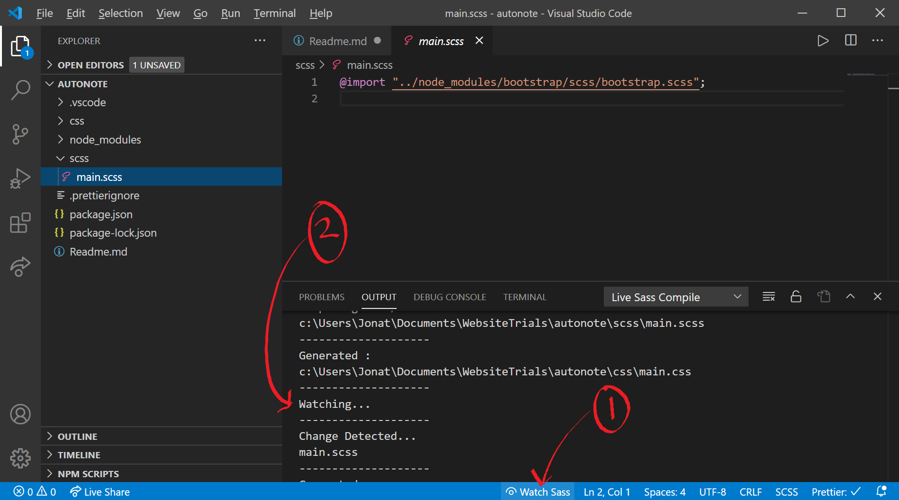

# TODO:
- Modify figures to allow custom sizes (e.g. 1-12 and then provide sensible guesses on break points)

# Project Setup

## Editor

This project has been designed to work in VSCode. While you can use any editor that you desire, using VSCode will allow you to utilise the automatic project setup tools that I have put in place for the workspace.

## Install Ruby and Bundler

This project requires ruby and bundler. As such, you will need a working installation of these. You can check this using `ruby -v` and `bundle -v`.

1. You can get ruby here: https://www.ruby-lang.org/en/downloads/
2. When finished with this you will need to restart VSCode.
3. You can then install bundler using `gem install bundler`

## Install VSCode extensions

This project has a set of recommended extensions for VSCode. As such, a prompt will appear when you first open the project in VSCode. Simply select install all.

## Run Bundler

Once you have pulled the project from the repo run `bundle install`. NOTE: It is critical that the path for this project has no space characters or this operation will fail!

## Install Bootstrap and other NPM dependencies

This project currently uses Bootstrap 5.0 Beta 1 and Bootstraps Icons. The install process for these systems is best achieved through npm:

Run `npm install` in the workspace terminal (<kbd>ctrl</kbd> + <kbd>'</kbd>).

It should be noted that Bootstrap 5.0 is still an early alpha. So things will change!

## Settings

The extension settings should be included within the workspaces "settings.json" file. User specific settings may then be used if further changes are desired.

# Editing

There is a process that must be followed when editing this project.

## 1) Start SCSS watcher

Before making changes to the look of the site, it is important to ensure that all SCSS changes are compiled on save. This is best achieved by starting the live SCSS watcher found at the bottom of VSCode (1). This should then display an output that confirms watching is active (2).

## 2) Start the jekyll server

Run `bundle exec jekyll serve` in the workspace terminal (<kbd>ctrl</kbd> + <kbd>'</kbd>).

## 3) Make your edits

You are now good to edit the project. Later on, we will go into more detail on how best to produce new style files or add new pages of different types. For now it is early days.